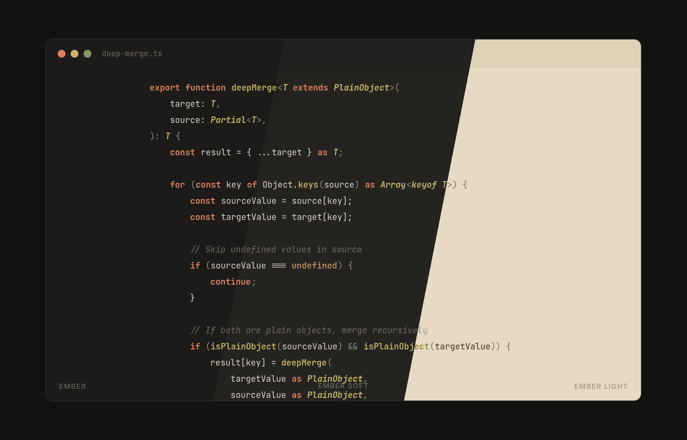
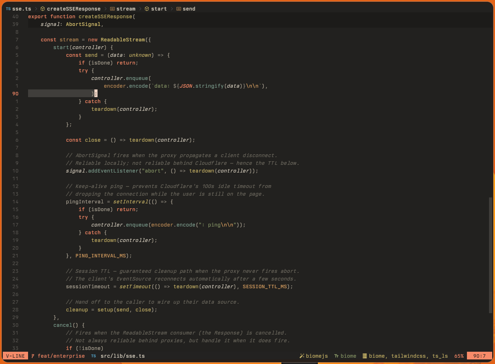
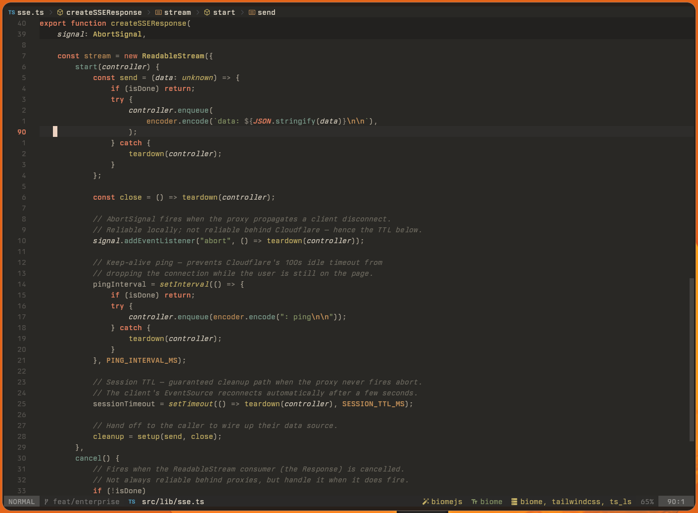
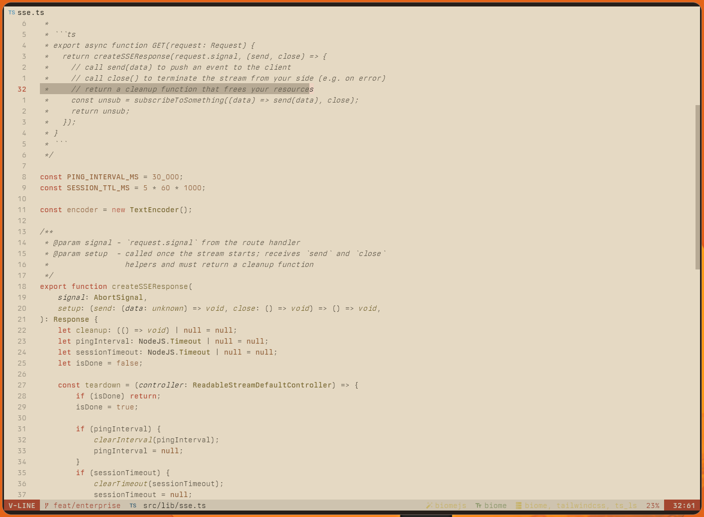
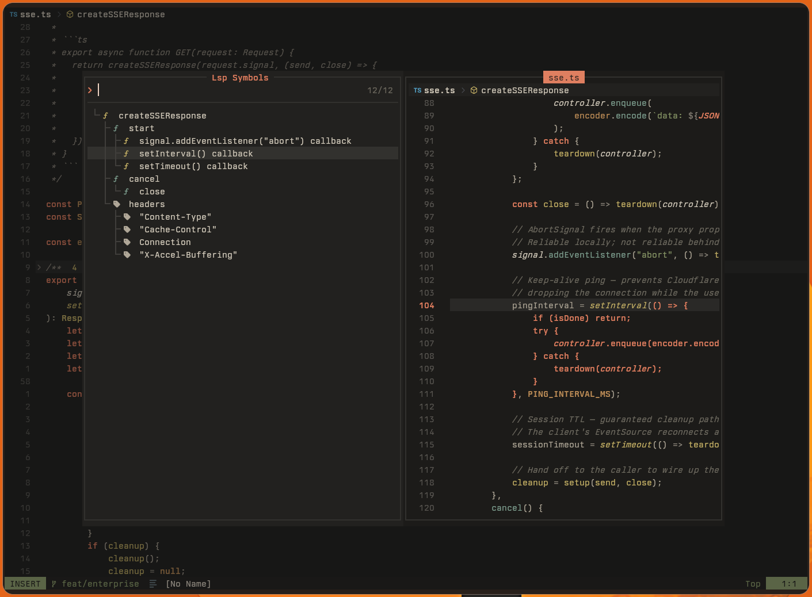
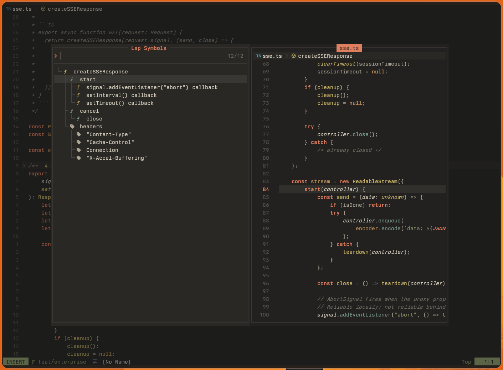
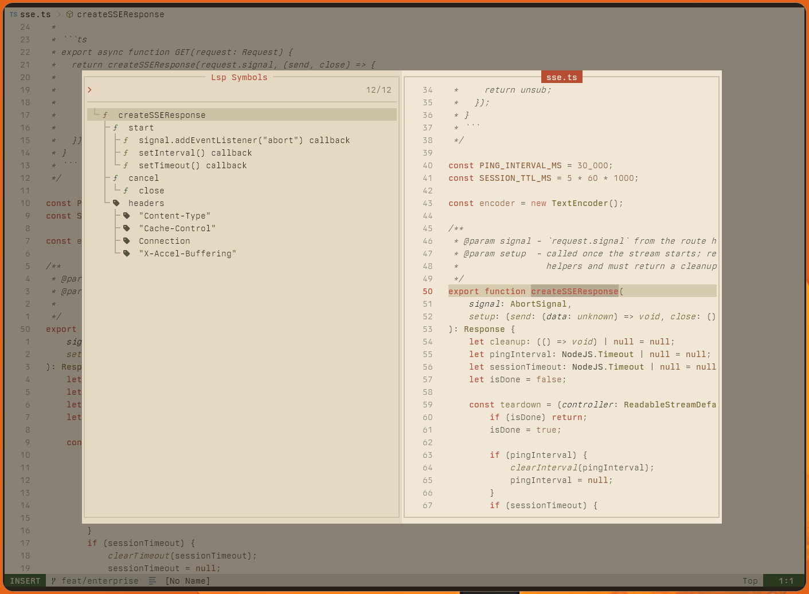

<p align="center">
  
</p>

<h1 align="center">Ember for Neovim</h1>

<p align="center">
  A warm, nearly monochrome Neovim theme.<br/>
  Muted tones, deliberate restraint, and one coral accent that cuts through everything.
</p>

<p align="center">
  <a href="https://embertheme.com">embertheme.com</a> ·
  <a href="https://github.com/ember-theme/ember">Palette</a> ·
  <a href="#installation">Installation</a> ·
  <a href="#variants">Variants</a> ·
  <a href="#plugin-support">Plugin Support</a>
</p>

---

<p align="center">
  
</p>

<p align="center">
  
</p>

## Screenshots

<table>
<tr>
<td align="center"><b>Ember</b><br><sub>dark graphite</sub></td>
<td align="center"><b>Ember Soft</b><br><sub>lifted graphite</sub></td>
<td align="center"><b>Ember Light</b><br><sub>warm ivory</sub></td>
</tr>
<tr>
<td></td>
<td></td>
<td></td>
</tr>
<tr>
<td></td>
<td></td>
<td></td>
</tr>
</table>

## Variants

| Variant | Background | Description |
|---------|-----------|-------------|
| `ember` |  `#1c1b19` | Dark graphite, L10% — the default |
| `ember-soft` |  `#242320` | Lifted graphite, L13% — softer contrast |
| `ember-light` |  `#e6dac4` | Warm ivory, L84% — darkened accents for WCAG AA |

## Installation

### lazy.nvim

```lua
{
  "ember-theme/nvim",
  name = "ember",
  priority = 1000,
  config = function()
    require("ember").setup({
      variant = "ember", -- "ember" | "ember-soft" | "ember-light"
    })
    vim.cmd("colorscheme ember")
  end,
}
```

Switch variants at runtime:

```
:colorscheme ember
:colorscheme ember-soft
:colorscheme ember-light
```

## Plugin Support

Built-in highlight coverage for:

| Category | Plugins |
|----------|---------|
| Syntax | Treesitter (`@capture` groups), LSP semantic tokens, diagnostics |
| Picker | Telescope, Snacks picker |
| Completion | nvim-cmp, blink.cmp |
| UI | Which-key, Snacks dashboard, Snacks notifier |
| File tree | Neo-tree, Snacks explorer |
| Git | Gitsigns |
| Indent | indent-blankline, Snacks indent |
| Statusline | mini.statusline, mini.tabline, Lualine |
| Other | Noice, Lazy.nvim, mini.jump, mini.pick |

## Links

- [Ember core](https://github.com/ember-theme/ember) — palette, brand, ports
- [Emacs port](https://github.com/ember-theme/emacs) — reference implementation
- [Website](https://embertheme.com)

## License

MIT — Hossam Saraya
